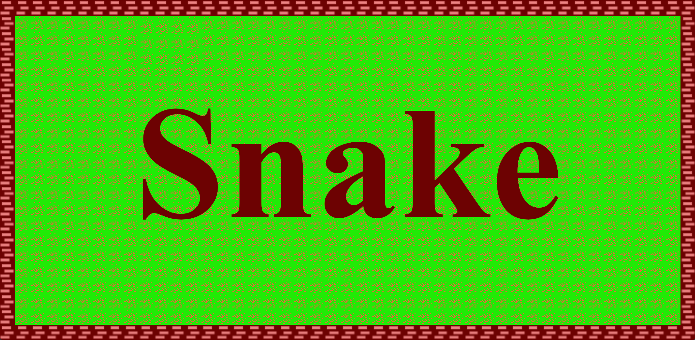

# Snake Game

This is a Snake game built using SFML (Simple and Fast Multimedia Library). The game is powered by its own state-based engine.

## Table of Contents

- [Requirement](#requirement)
- [Installation](#installation)
- [Run Program](#run-program)
- [Project Structure](#project-structure)
- [Author](#author)

## Requirement

- [Git](https://git-scm.com/) to clone the repository
- [CMake](https://cmake.org/) 3.16 or higher
- [SFML](https://www.sfml-dev.org/) (Simple and Fast Multimedia Library)
- [GCC](https://code.visualstudio.com/docs/cpp/config-mingw) compiler

## Installation

### Cloning the Repository
Use Command Prompt or Windows PowerShell.
```bash
git clone https://github.com/WARDROK/Snake.git
cd Snake
```

### Building project

```bash
cmake -B build
cmake --build build  
```

## Run Program
```bash
./build/bin/Debug/main.exe   
```

You can also copy the main.exe file to the project folder (Snake) and run it via the graphical interface or command:

```bash
cp ./build/bin/Debug/main.exe ./
./main.exe
```

## Project Structure
```
Snake/
├── assets/
│   ├── fonts/
│   ├── textures/
│   ├── snake.ico
│   └── snake.png
│   └── Game.png
├── include/ // Header Files
├── src/
│   ├── AssetMan.cpp
│   ├── Game.cpp
│   ├── GameOver.cpp
│   ├── GamePlay.cpp
│   ├── MainMenu.cpp
│   ├── PauseGame.cpp
│   ├── Snake.cpp
│   ├── StateMan.cpp
│   └── main.cpp
├── .gitignore
├── CMakeLists.txt
├── Game.png
└── ReadME.md
```

## Author

Project created by Łukasz Szydlik